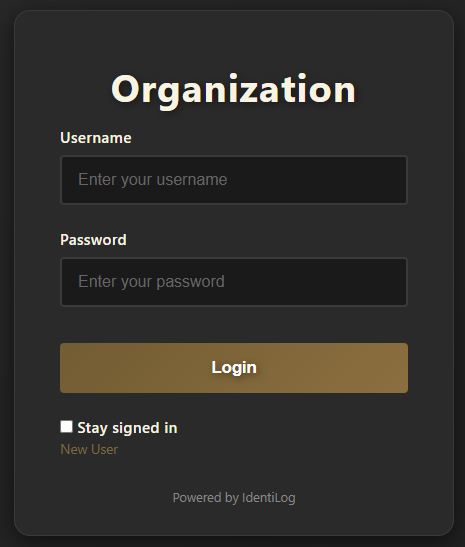
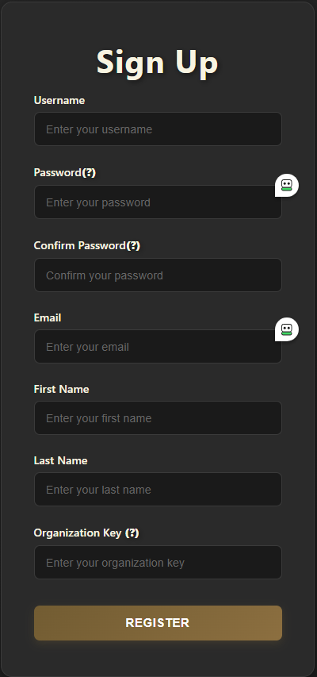
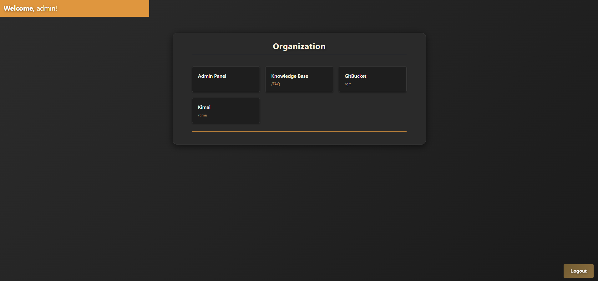
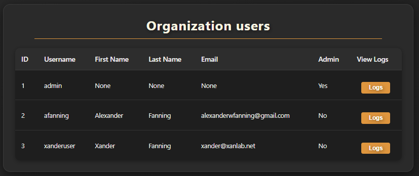
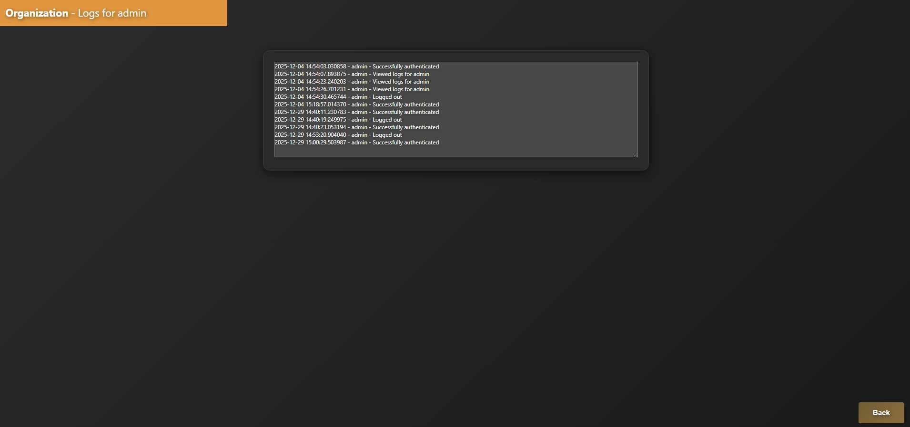

# IdentiLog
### Identity Access Management (IAM) with locally stored encrypted databases using SQLCipher.

## What is it?
IdentiLog is a site that offers registration and login functionality and allows users access to an internal service map while admins have access to user logs.

## Why are you making this?
The purpose of this project is to gain experience with "full-stack" development. This is the first proper program I have written so there are bound to be a lot of mistakes and suboptimal ways to go about things. I am attempting to create everything from scratch to demonstrate and develop my understanding of fundamental concepts.

## Features
- Secure user registration and authentication
- Role-based access control (user/admin)
- Encrypted local database storage using SQLCipher
- Admin dashboard with user management
- User activity logging
- Internal service map for authenticated users

## Tech Stack
- **Backend**: Flask (Python)
- **Database**: SQLite with SQLCipher encryption
- **Frontend**: HTML/CSS


## Login Page:


## Registration:


## Dashboard:


## User table:


## User logs:


## How to set up the .env file
Here is a list of environment variables necessary for operation

```
##################################################
#               ### NOTE: ###
# The name of this file should be EXACTLY: ".env"


# Name of your DB
USER_DB='yourdbname.db'

# For DEBUG purposes only. Leave as FALSE
REQUIRE_COMMIT='False'

# This key is only ever used internally and should be very complex.
DB_KEY='alnum_key' 

# Admin account is automatically made when a new database is initialized. Change these and sign in with them
ADMIN_USERNAME='admin'

# This password is currently plaintext in .env but will be hashed in the DB file. DELETE THIS AFTER DB CREATION
ADMIN_PASSWORD='password'

# This key is used to encrypt session cookies. Make it something very complex.
FLASK_SECRET_KEY='flask_key'

# This is known as the "Organization Key". This is what new users will have to enter to sign up through the portal.
NEW_USER_PASSWORD='org_key'

# This will be the text that shows up on the login page and dashboard
ORGANIZATION='Organization'

```

# How to set up development environment:

## Prerequisites
- Python 3.x
- pip
- Linux/Ubuntu (for SQLCipher installation)

## Setup Steps

### 1. Clone or download this repository
```bash
cd ~
mkdir -p projects
cd projects
# Clone the repo here or extract the downloaded files
cd identilog
```

### 2. Configure environment variables
Copy `.env.example` to `.env` and edit the values:
```bash
cp .env.example .env
nano .env  # or use your preferred editor
```

### 3. Install dependencies
```bash
sudo apt-get update
sudo apt-get install -y libsqlcipher-dev
pip install --upgrade pip
python -m venv .venv
source .venv/bin/activate
pip install -r requirements.txt
```

### 4. Run the application
```bash
flask --app pages run --debug
```

The application will be available at `http://127.0.0.1:5000`

## Security Notice
This is a learning project and may not be suitable for production use without further security hardening. Please review the code and security practices before deploying in any production environment.
